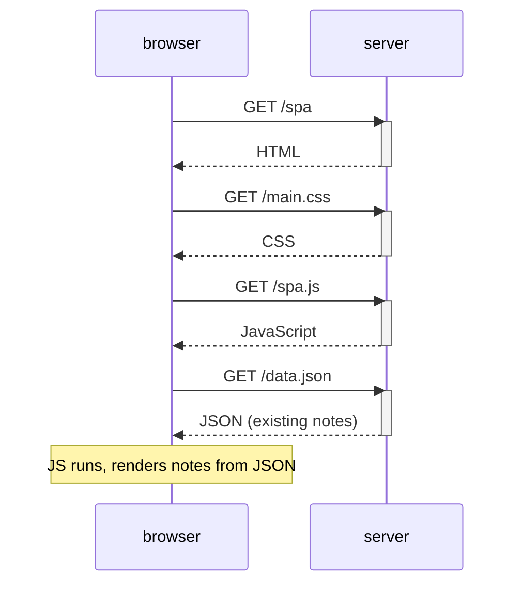

## Exercise 0.5 — Load SPA

```mermaid
sequenceDiagram
    participant browser
    participant server

    browser->>server: GET /spa
    activate server
    server-->>browser: HTML
    deactivate server

    browser->>server: GET /main.css
    activate server
    server-->>browser: CSS
    deactivate server

    browser->>server: GET /spa.js
    activate server
    server-->>browser: JavaScript
    deactivate server

    browser->>server: GET /data.json
    activate server
    server-->>browser: JSON (existing notes)
    deactivate server

    note over browser: JS runs, renders notes from JSON
```